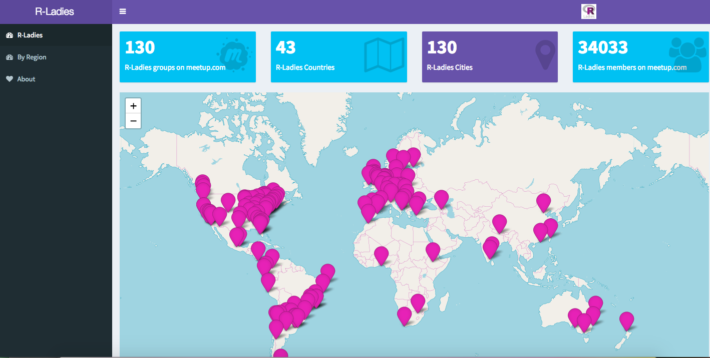

```{r setup, include=FALSE}
options(htmltools.dir.version = FALSE)
```


# What is R-Ladies?

  
  
<span style="color:#FFFFFF">Making white space  White space cool </span>  
   
    
    
Worldwide organization that <span style="color:#562457">promotes **gender diversity**</span> in the <span style="color:#562457">**R**</span> community via <span style="color:#562457">meetups and mentorship</span> in a <span style="color:#562457">**friendly** and **safe**</span> environment.  

---
  
# We have 130 chapters worldwide 
  

  
*See our [rshinylady app](https://gqueiroz.shinyapps.io/rshinylady/)*!
  
---
  
# We have a chapter in Chicago!  
    
```{r, eval=FALSE,echo=TRUE}
library(dplyr)

rladies_global %>%
  filter(city == 'Chicago')
```
  
   
  
---

# What we do  
  
## Monthly Meetups  
  
* Talks   
* Tutorials  
* Collaborative Coding/Hackathon-style activities  
  
--
  
## Career Development  
  
* Networking & Social Events  
* Online **Slack** community with job listings  
* Scholarship opportunities for local conferences  
* [Abstract & Scholarship reviews](http://tinyurl.com/rladiesabstracts)   
  

---
  
# Study Groups   
  
Small groups that discuss specialized topics in R. These meetings are <span style="color:#562457">**hands-on**, **collaborative**</span> discussions where participants walk through different R techniques together.       
  
  
## Current Study Group Topics:    
    
* Astrostatistics   
* Data Visualization  
* Natural Language Processing    
* GIS & Spatial Data in R    
  
---
  
# Are men welcome to attend R-Ladies events?  
  
**Yes, men are welcome at our events.**  
  
* Our mission is to <span style="color:#562457">encourage more women and non-binary individuals to get involved in the R community.</span>   
* Please help us by spreading the word about R-Ladies, and by being respectful of the fact that <span style="color:#562457">our events are primarily for women/non-binary/female-identifying individuals.</span>    
  
  
We also expect all attendees to abide by our [community code of conduct](https://rladies.org/code-of-conduct/).      
  
  
---
    
# Attend our November Meetup!  
  
## Tutorial on R + Git/Github  
  
When: **Tuesday, Nov. 13, 6-8pm**    
Where: **Regents Hall, Loyola Watertower Campus, 111 E. Pearson St.**   
  

**RSVP on our [Meetup Page](https://www.meetup.com/rladies-chicago/)**
   
   
---

class: center, inverse 

# Connect with us!  
  
## Email me with questions  
  
<a href="mailto:katherine@rladies.org"><i class="fa fa-paper-plane fa-fw"></i>&nbsp; Katherine@rladies.org</a><br>  
  
--
  
## Contact R-Ladies Chicago  
  
<a href="mailto:chicago@rladies.org"><i class="fa fa-paper-plane fa-fw"></i>&nbsp; chicago@rladies.org</a><br> 
<a href="https://rladieschicago.org/"><i class="fa fa-link fa-fw"></i>&nbsp; rladieschicago.org</a><br>  


